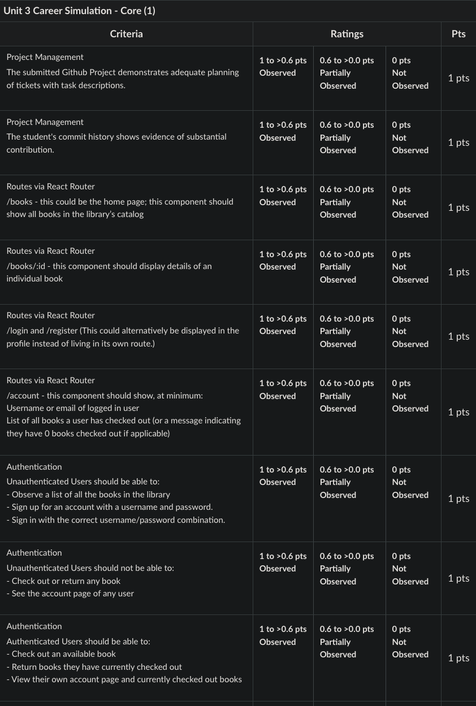
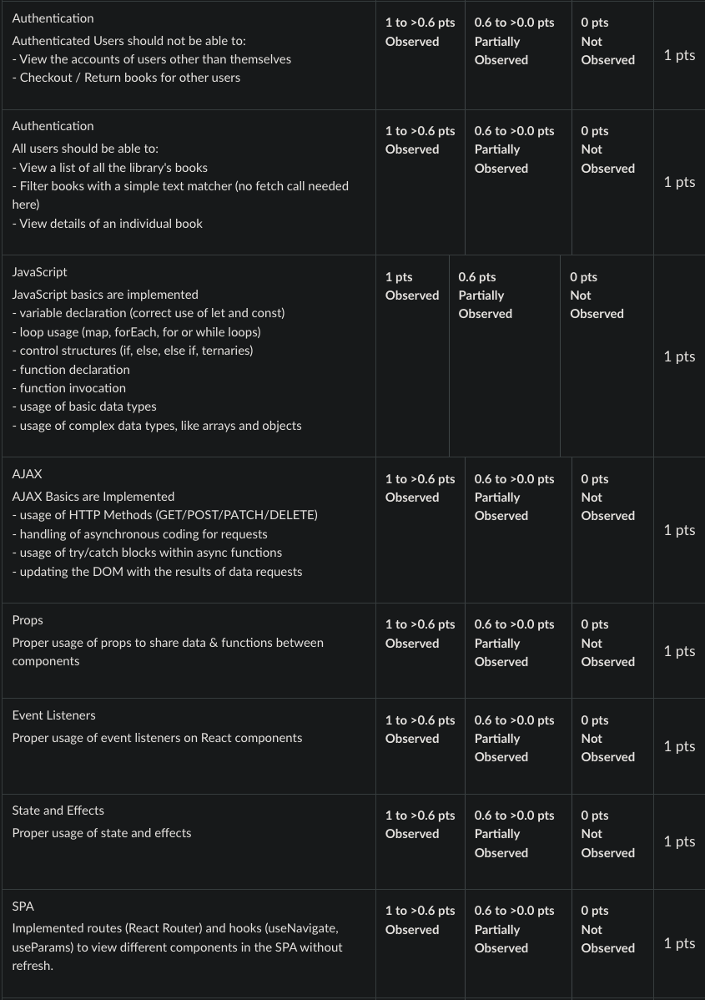
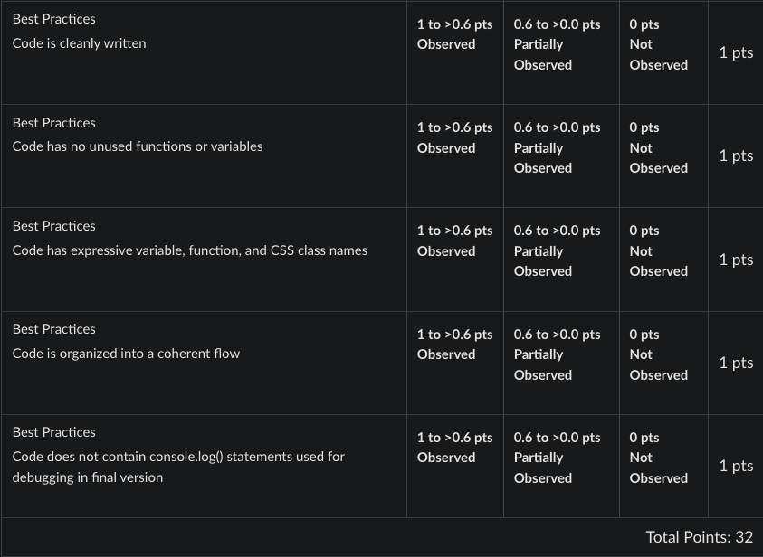

# Block 30 - Book Buddy

## Getting Started

1. Review the [API](https://fsa-book-buddy-b6e748d1380d.herokuapp.com/docs/), which is hosted on the BookBuddy API. Note: This API is different in that it allows us to do more than request data. It also allows us to log in, and even check out books. To do this, recall CRUD and user authentication via JSON Web Tokens (JWT).

# Rubric

## Introduction

We are working with a new client who is wanting to design an online library for the public. Another Full Stack Solutions team has already built out the API, but we need your assistance in developing the front end to ensure on-time delivery to the client. When this is complete, please submit the link to the deployed application so I can share it with the client.

Details on the API can be found 🔗 [here](https://fsa-book-buddy-b6e748d1380d.herokuapp.com/docs/)

## Requirements

Project Management Requirements

- GitHub Project
  - Have detailed planning tickets with task descriptions for each one.
- Have a GitHub repository containing all relevant code for the project.
  - Have an updated GitHub repository with new commits.

Functionality Requirements

- Routes via React Router (This is a minimum; you could have more than just these routes. These routes may be named as you wish.)
  - `/books` - this could be the home page; this component should show all books in the library’s catalog
  - `/books/:id` - this component should display details of an individual book
  - `/login` and `/register` (This could alternatively be displayed in the profile instead of living in its own route.)
  - `/account` - this component should show, at minimum
    - Username or email of logged in user
    - List of all books a user has checked out (or a message indicating they have 0 books checked out if applicable)
- Unauthenticated Users should be able to
  - Observe a list of all the books in the library
  - Sign up for an account with a username and password.
  - Sign in with the correct username/password combination
- Unauthenticated Users should not be able to
  - Check out or return any book
  - See the account page of any user
- Authenticated Users should be able to:
  - Check out an available book
  - Return books they have currently checked out
  - View their own account page and currently checked out books
- Authenticated Users should not be able to:
  - View the accounts of users other than themselves
  - Checkout / Return books for other users
- All users should be able to:
  - View a list of all the library's books
  - Filter books with a simple text matcher (no fetch call needed here)
  - View details of an individual book

Implementation Requirements

- Front-End State Management (Redux)
- The React app is connected to the API using RTK Query
- There are query and mutation endpoints for all CRUD operations on books and users.
- CSS Basics including
  - proper use of Flex / Grid for creating layouts
  - proper use of cascading and specificity to prevent bleed into unrelated elements
  - intuitive User Experience (UX) through a clean interface
- Testing - JEST
  - properly written tests to check correct render of react components
